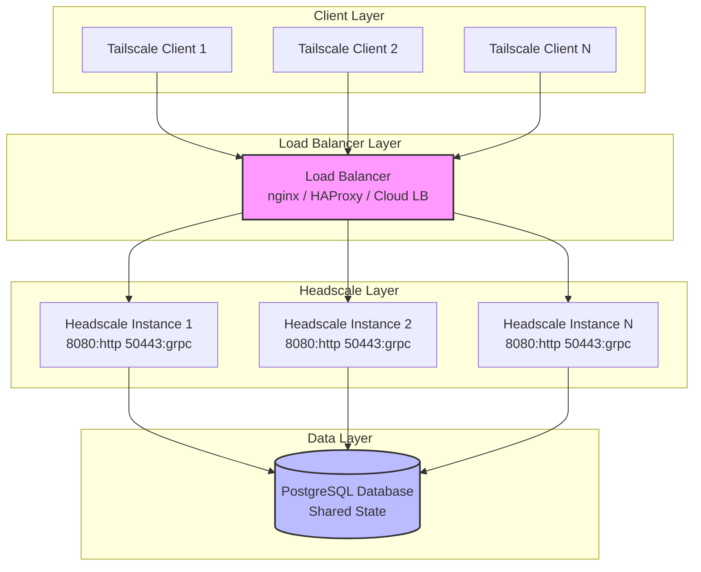
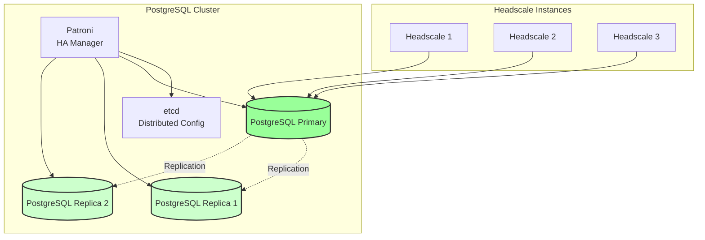
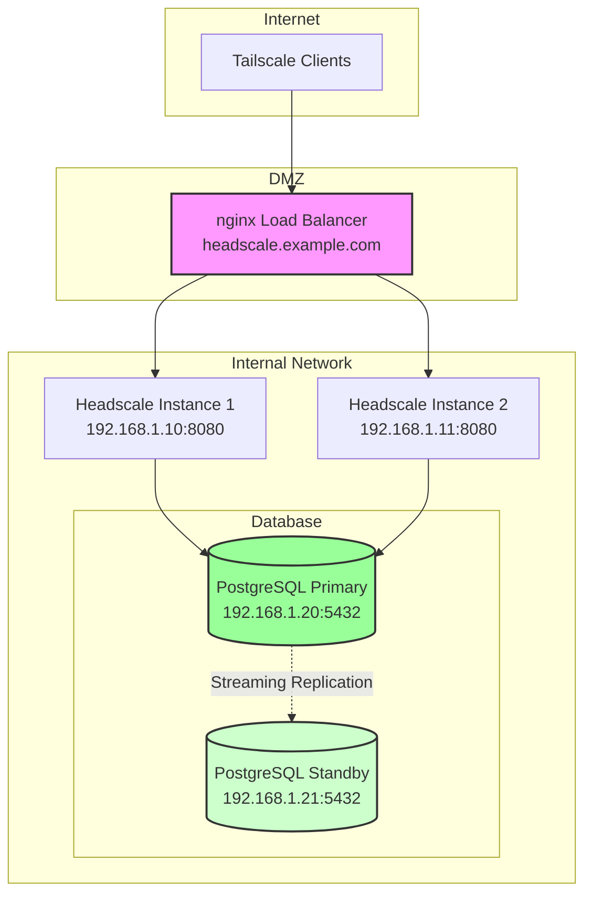
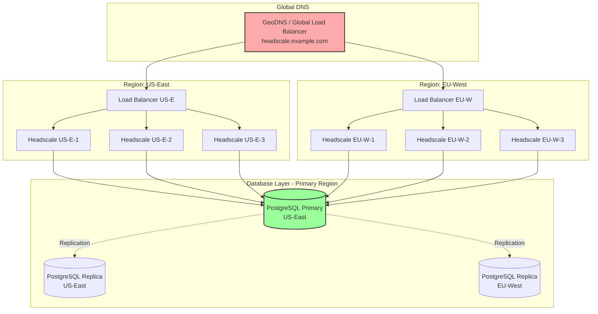
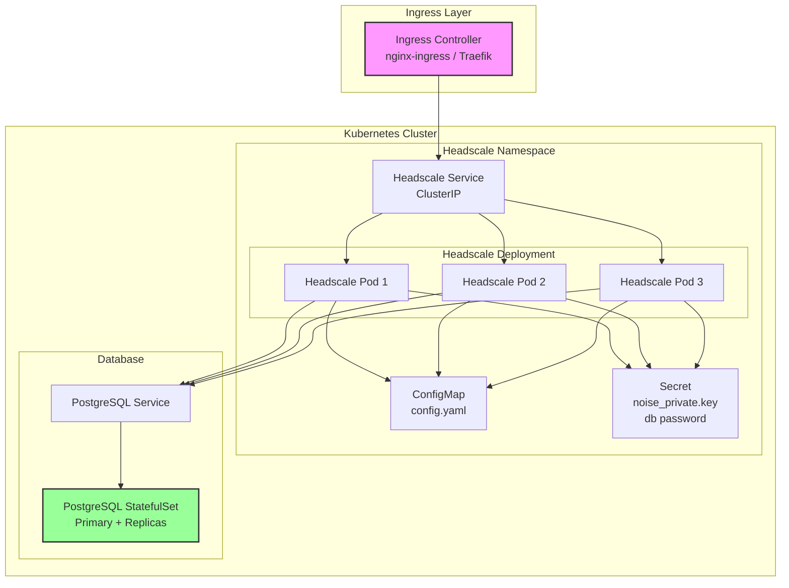

# High Availability (HA) Setup

## Introduction

High Availability (HA) is essential for production deployments of headscale where continuous uptime and reliability are critical. An HA setup ensures that your Tailscale network remains operational even if individual components fail, providing:

- **Continuous service availability**: No single point of failure disrupts your entire network
- **Improved reliability**: Automatic failover when issues occur
- **Maintenance flexibility**: Upgrade or maintain individual instances without downtime
- **Scalability**: Distribute load across multiple instances to handle more clients

This guide is intended for production deployments and organizations that require uptime guarantees for their Tailscale infrastructure. For single-node deployments or development environments, a standard installation is sufficient.

## Architecture Overview

A headscale HA deployment consists of multiple headscale instances sharing a common database and fronted by a load balancer. The architecture leverages headscale's stateless control plane design with centralized state management.



### Key Components

- **Tailscale Clients**: Connect to the headscale control server via the load balancer
- **Load Balancer**: Distributes traffic across headscale instances and performs health checks
- **Headscale Instances**: Multiple stateless control plane servers sharing configuration
- **PostgreSQL Database**: Centralized persistent storage for all headscale state

## Common Approaches Discussion

### Active-Passive (Failover)

In an active-passive setup, one headscale instance handles all traffic while one or more standby instances remain idle, ready to take over if the primary fails.

**How it works:**

- One primary headscale instance serves all client requests
- Secondary instances monitor the primary (or load balancer does health checks)
- On primary failure, traffic is redirected to a secondary instance
- Database remains the single source of truth

**Pros:**

- Simpler to configure and manage
- Lower resource utilization (standbys mostly idle)
- No concerns about state synchronization or session affinity

**Cons:**

- Underutilizes standby resources
- Slower failover (detection delay + connection establishment)
- Primary instance may become a performance bottleneck
- Does not distribute load for scalability

**When to use:**

- Smaller deployments (< 100 nodes)
- When simplicity is more important than maximum availability
- Budget-constrained environments with limited resources

### Active-Active (Load Balanced)

In an active-active setup, multiple headscale instances actively serve client requests simultaneously, with the load balancer distributing traffic among them.

**How it works:**

- All headscale instances are live and handling requests
- Load balancer distributes incoming connections across instances
- All instances share the same PostgreSQL database for state
- In-memory caches (NodeStore) are independently maintained per instance

**Pros:**

- Better resource utilization - all instances serve traffic
- Improved performance through load distribution
- Faster failover - other instances already running
- Horizontal scalability - add more instances as needed
- No single bottleneck for control plane operations

**Cons:**

- More complex configuration and monitoring
- Requires understanding of headscale's caching behavior
- Database becomes the critical bottleneck (must be highly available)
- Potential for cache inconsistency during rapid state changes

**When to use:**

- Medium to large deployments (100+ nodes)
- When performance and scalability are priorities
- Organizations with mature operational practices
- **Recommended for most production HA deployments**

### Database-Level HA

Database reliability is critical for headscale HA. The database stores all persistent state including nodes, users, routes, and policies.

#### PostgreSQL Replication Options

**Primary-Replica (Streaming Replication):**

- Primary handles all writes, replicas serve reads
- For headscale HA, all instances should connect to the primary
- Replicas provide backup for disaster recovery
- Automatic failover with tools like Patroni or Stolon

**Example with Patroni:**



**Cloud-Managed Options:**

- AWS RDS with Multi-AZ deployment
- Google Cloud SQL with high availability
- Azure Database for PostgreSQL with read replicas

#### SQLite with Litestream

For single-node deployments transitioning to HA, or for backup purposes:

**Litestream** provides continuous SQLite replication to S3-compatible storage:

- Streams WAL (Write-Ahead Log) changes to object storage
- Enables point-in-time recovery
- **Not recommended for true multi-instance HA** (SQLite is single-writer)
- Useful for disaster recovery and migration to PostgreSQL

### Why We Recommend Active-Active with PostgreSQL

Based on headscale's architecture, **active-active with PostgreSQL is the recommended approach** for true HA deployments:

#### Headscale's Architecture Supports This

1. **Stateless Control Plane**: `hscontrol/state/state.go` manages state with database backing
2. **Copy-on-Write NodeStore**: `hscontrol/state/node_store.go` uses thread-safe in-memory caching
3. **Registration Cache**: Uses `zcache` with configurable expiration to reduce database load
4. **Designed for Concurrency**: GORM with connection pooling handles multiple instances

#### Database Considerations

- **PostgreSQL** is better suited for multi-instance deployments:
  - True concurrent writes from multiple instances
  - ACID transactions ensure data consistency
  - Connection pooling via `MaxIdleConnections`, `MaxOpenConnections`, `ConnMaxIdleTimeSecs`
  - Well-tested with distributed systems

- **SQLite** is recommended for single-node but has limitations for HA:
  - Single-writer limitation prevents true active-active
  - Write-Ahead Logging (WAL) mode helps but doesn't solve multi-instance writes
  - Network file systems (NFS/CIFS) cause corruption with SQLite
  - Excellent for single-node performance, problematic for distributed setups

#### Trade-offs

**Pros of Active-Active + PostgreSQL:**

- True high availability and load distribution
- Proven architecture for distributed systems
- Scales horizontally with more headscale instances
- Each instance's NodeStore provides read performance
- Database handles synchronization and consistency

**Cons and Mitigations:**

- Database becomes a critical dependency → Use PostgreSQL HA solutions
- Potential for cache lag between instances → Acceptable for headscale's use case (registration and poll operations are infrequent)
- More complex operations → Offset by operational maturity and tooling
- Higher resource requirements → Justified by reliability and performance gains

## Components

### Load Balancer

The load balancer is the entry point for all client connections and distributes traffic across headscale instances.

#### Options

**nginx** (Open Source):

- HTTP/HTTPS load balancing with health checks
- WebSocket support for long-lived connections
- Easy to configure and widely deployed

**HAProxy** (Open Source):

- Advanced load balancing with sophisticated health checks
- TCP and HTTP mode support
- Excellent performance and observability

**Cloud Load Balancers**:

- AWS Application/Network Load Balancer
- Google Cloud Load Balancing
- Azure Load Balancer
- Managed service, automatic scaling, built-in monitoring

#### Requirements

- **Layer 7 (HTTP) or Layer 4 (TCP)**: Both work, HTTP preferred for path-based routing
- **Health checks**: Monitor headscale instance health
- **Session persistence**: Not strictly required but can reduce cache churn
- **TLS termination**: Can be done at load balancer or at headscale instances
- **WebSocket support**: For gRPC and long-lived HTTP/2 connections

### PostgreSQL Database

PostgreSQL is the shared data layer storing all headscale state.

#### Configuration Considerations

**Connection Pooling**: Essential for multiple headscale instances

- `max_open_conns`: Maximum concurrent connections per headscale instance (default: 10)
- `max_idle_conns`: Idle connections kept in pool (default: 10)
- `conn_max_idle_time_secs`: How long idle connections persist (default: 3600)

**Performance Tuning**:

- `shared_buffers`: 25% of system RAM for dedicated database server
- `effective_cache_size`: 50-75% of system RAM
- `work_mem`: Adjust based on concurrent queries (start with 4MB)
- `maintenance_work_mem`: For vacuuming and indexing (256MB+)

**High Availability**:

- Primary-replica replication for failover
- Automated failover with Patroni, Stolon, or cloud-native solutions
- Connection pooling with PgBouncer for large deployments

### Multiple Headscale Instances

Each headscale instance should:

- Use identical configuration (except instance-specific settings like listen addresses)
- Connect to the same PostgreSQL database
- Share the same Noise private key for client encryption
- Use the same DERP configuration
- Have synchronized ACL policies (if using file-based policies)

#### Resource Requirements per Instance

- **CPU**: 2-4 cores (depends on node count and poll frequency)
- **Memory**: 1-4 GB (NodeStore cache grows with node count)
- **Storage**: Minimal (logs only, no database)
- **Network**: Low bandwidth, many concurrent connections

### Shared Configuration Management

Configuration must be consistent across all instances.

**Options:**

- **Configuration Management**: Ansible, Puppet, Chef to deploy identical configs
- **Container Orchestration**: Kubernetes ConfigMaps/Secrets
- **Version Control**: Store configuration in Git, deploy via CI/CD
- **Centralized Storage**: Mount shared config from NFS/cloud storage (use cautiously)

**Critical Shared Elements:**

- `server_url`: Must be the load balancer URL
- `noise.private_key_path`: Share the same Noise key (security: protect carefully!)
- Database connection settings
- DERP configuration
- ACL policies (if file-based)

### Health Checks

Implement health checks at multiple levels:

**Load Balancer Health Checks:**

- HTTP GET to `/health` or `/` endpoint
- Check interval: 5-10 seconds
- Failure threshold: 2-3 consecutive failures
- Success threshold: 2 consecutive successes

**Database Connection Health:**

- Headscale monitors database connectivity
- If database connection fails, instance should fail health checks

**Example nginx health check:**

```nginx
upstream headscale_backend {
    server headscale1:8080 max_fails=3 fail_timeout=30s;
    server headscale2:8080 max_fails=3 fail_timeout=30s;
    server headscale3:8080 max_fails=3 fail_timeout=30s;
}
```

## Configuration

### PostgreSQL Configuration

**PostgreSQL connection in headscale config:**

```yaml
database:
  type: postgres
  
  postgres:
    host: postgres.example.com
    port: 5432
    name: headscale
    user: headscale
    pass: securepassword
    
    # Connection pool settings for HA
    max_open_conns: 25
    max_idle_conns: 10
    conn_max_idle_time_secs: 3600
    
    # SSL configuration
    ssl: true
    # Optional: specify SSL mode if needed
    # sslmode: require
```

**PostgreSQL server configuration** (`postgresql.conf`):

```ini
# Connection settings
max_connections = 200
superuser_reserved_connections = 3

# Memory settings
shared_buffers = 4GB
effective_cache_size = 12GB
work_mem = 16MB
maintenance_work_mem = 512MB

# WAL settings for replication
wal_level = replica
max_wal_senders = 10
max_replication_slots = 10
```

### Load Balancer Configuration Examples

#### nginx Configuration

```nginx
upstream headscale_http {
    least_conn;
    server headscale1.local:8080 max_fails=3 fail_timeout=30s;
    server headscale2.local:8080 max_fails=3 fail_timeout=30s;
    server headscale3.local:8080 max_fails=3 fail_timeout=30s;
}

upstream headscale_grpc {
    least_conn;
    server headscale1.local:50443 max_fails=3 fail_timeout=30s;
    server headscale2.local:50443 max_fails=3 fail_timeout=30s;
    server headscale3.local:50443 max_fails=3 fail_timeout=30s;
}

# HTTP/HTTPS frontend
server {
    listen 443 ssl http2;
    server_name headscale.example.com;
    
    ssl_certificate /etc/nginx/ssl/headscale.crt;
    ssl_certificate_key /etc/nginx/ssl/headscale.key;
    
    location / {
        proxy_pass http://headscale_http;
        proxy_set_header Host $host;
        proxy_set_header X-Real-IP $remote_addr;
        proxy_set_header X-Forwarded-For $proxy_add_x_forwarded_for;
        proxy_set_header X-Forwarded-Proto $scheme;
        
        # WebSocket support
        proxy_http_version 1.1;
        proxy_set_header Upgrade $http_upgrade;
        proxy_set_header Connection "upgrade";
        
        # Timeouts for long-lived connections
        proxy_connect_timeout 60s;
        proxy_send_timeout 300s;
        proxy_read_timeout 300s;
    }
}

# gRPC frontend
server {
    listen 50443 ssl http2;
    server_name headscale.example.com;
    
    ssl_certificate /etc/nginx/ssl/headscale.crt;
    ssl_certificate_key /etc/nginx/ssl/headscale.key;
    
    location / {
        grpc_pass grpc://headscale_grpc;
        grpc_set_header X-Real-IP $remote_addr;
        
        # gRPC timeouts
        grpc_connect_timeout 60s;
        grpc_send_timeout 300s;
        grpc_read_timeout 300s;
    }
}

# HTTP to HTTPS redirect
server {
    listen 80;
    server_name headscale.example.com;
    return 301 https://$host$request_uri;
}
```

#### HAProxy Configuration

```haproxy
global
    log /dev/log local0
    maxconn 4096
    
defaults
    log global
    mode http
    option httplog
    option dontlognull
    timeout connect 5000ms
    timeout client 300000ms
    timeout server 300000ms
    
# HTTP/HTTPS frontend
frontend headscale_http_front
    bind *:443 ssl crt /etc/haproxy/certs/headscale.pem
    default_backend headscale_http_back
    
backend headscale_http_back
    balance leastconn
    option httpchk GET /
    http-check expect status 200
    
    server headscale1 headscale1.local:8080 check inter 10s fall 3 rise 2
    server headscale2 headscale2.local:8080 check inter 10s fall 3 rise 2
    server headscale3 headscale3.local:8080 check inter 10s fall 3 rise 2
    
# gRPC frontend (TCP mode)
frontend headscale_grpc_front
    bind *:50443 ssl crt /etc/haproxy/certs/headscale.pem
    mode tcp
    default_backend headscale_grpc_back
    
backend headscale_grpc_back
    mode tcp
    balance leastconn
    
    server headscale1 headscale1.local:50443 check inter 10s fall 3 rise 2
    server headscale2 headscale2.local:50443 check inter 10s fall 3 rise 2
    server headscale3 headscale3.local:50443 check inter 10s fall 3 rise 2
```

### Headscale Instance Configuration

Each headscale instance should have nearly identical configuration:

```yaml
# server_url must point to the load balancer
server_url: https://headscale.example.com:443

# Instance-specific: bind to all interfaces for container/cloud deployment
listen_addr: 0.0.0.0:8080
metrics_listen_addr: 0.0.0.0:9090
grpc_listen_addr: 0.0.0.0:50443
grpc_allow_insecure: false

# Shared Noise key - CRITICAL: all instances must use the same key
noise:
  private_key_path: /etc/headscale/noise_private.key

# IP allocation - identical across instances
prefixes:
  v4: 100.64.0.0/10
  v6: fd7a:115c:a1e0::/48
  allocation: sequential

# DERP configuration - identical across instances
derp:
  server:
    enabled: false
  urls:
    - https://controlplane.tailscale.com/derpmap/default
  auto_update_enabled: true
  update_frequency: 3h

# Database - PostgreSQL required for HA
database:
  type: postgres
  debug: false
  
  gorm:
    prepare_stmt: true
    parameterized_queries: true
    skip_err_record_not_found: true
    slow_threshold: 1000
  
  postgres:
    host: postgres.example.com
    port: 5432
    name: headscale
    user: headscale
    pass: ${HEADSCALE_DB_PASS}  # Use environment variable for security
    
    max_open_conns: 25
    max_idle_conns: 10
    conn_max_idle_time_secs: 3600
    
    ssl: true

# ACL policy - use database mode for HA, or sync files across instances
policy:
  mode: database
  # mode: file
  # path: /etc/headscale/acl.yaml

# Logging
log:
  format: json
  level: info

# Disable update checks in production
disable_check_updates: true
```

### TLS/Certificate Considerations

**Option 1: TLS Termination at Load Balancer (Recommended)**

- Load balancer handles TLS with valid certificates
- Headscale instances communicate over HTTP internally
- Simpler certificate management
- Ensure internal network is trusted or use VPN/private networking

**Option 2: End-to-End TLS**

- Load balancer passes through TLS to headscale instances
- Each headscale instance needs valid certificates
- More complex but provides end-to-end encryption
- Use Let's Encrypt with DNS-01 challenge for automation

**Option 3: TLS at Both Layers**

- Load balancer terminates external TLS
- Load balancer initiates new TLS to backend headscale instances
- Maximum security, most complexity

**Shared Certificate Considerations:**

- All headscale instances should share the same Noise private key
- Store Noise key securely (Kubernetes Secret, HashiCorp Vault, AWS Secrets Manager)
- Rotate Noise key carefully (requires coordinated rollout)

## Deployment Examples

### Basic 2-Node HA Setup

Minimal HA deployment with two headscale instances and simple load balancing:



**Characteristics:**

- 2 headscale instances for redundancy
- Single load balancer (consider HAProxy + keepalived for LB HA)
- PostgreSQL primary with streaming replica
- Manual failover for database (or use Patroni)

### Production-Grade Multi-Region Setup

Enterprise deployment with geographic redundancy:



**Characteristics:**

- Multiple regions for geographic redundancy and latency optimization
- GeoDNS routes clients to nearest region
- All headscale instances connect to primary database (consider read replicas)
- Database replication across regions for disaster recovery
- Cloud-native: AWS, GCP, or Azure multi-region deployment

### Kubernetes Deployment Pattern

Modern containerized deployment using Kubernetes:



**Kubernetes Deployment Example:**

```yaml
---
apiVersion: v1
kind: Namespace
metadata:
  name: headscale

---
apiVersion: v1
kind: ConfigMap
metadata:
  name: headscale-config
  namespace: headscale
data:
  config.yaml: |
    server_url: https://headscale.example.com
    listen_addr: 0.0.0.0:8080
    grpc_listen_addr: 0.0.0.0:50443
    
    database:
      type: postgres
      postgres:
        host: postgresql.headscale.svc.cluster.local
        port: 5432
        name: headscale
        user: headscale
        pass: ${HEADSCALE_DB_PASS}
        max_open_conns: 25
        max_idle_conns: 10
        conn_max_idle_time_secs: 3600
        ssl: false  # Internal cluster communication
    
    # ... rest of configuration

---
apiVersion: v1
kind: Secret
metadata:
  name: headscale-secret
  namespace: headscale
type: Opaque
data:
  noise_private.key: <base64-encoded-key>
  db_password: <base64-encoded-password>

---
apiVersion: apps/v1
kind: Deployment
metadata:
  name: headscale
  namespace: headscale
spec:
  replicas: 3
  selector:
    matchLabels:
      app: headscale
  template:
    metadata:
      labels:
        app: headscale
    spec:
      containers:
      - name: headscale
        image: headscale/headscale:latest
        ports:
        - containerPort: 8080
          name: http
        - containerPort: 50443
          name: grpc
        env:
        - name: HEADSCALE_DB_PASS
          valueFrom:
            secretKeyRef:
              name: headscale-secret
              key: db_password
        volumeMounts:
        - name: config
          mountPath: /etc/headscale
          readOnly: true
        - name: noise-key
          mountPath: /var/lib/headscale
          readOnly: true
        livenessProbe:
          httpGet:
            path: /health
            port: 8080
          initialDelaySeconds: 30
          periodSeconds: 10
        readinessProbe:
          httpGet:
            path: /health
            port: 8080
          initialDelaySeconds: 10
          periodSeconds: 5
        resources:
          requests:
            memory: "512Mi"
            cpu: "500m"
          limits:
            memory: "2Gi"
            cpu: "2000m"
      volumes:
      - name: config
        configMap:
          name: headscale-config
      - name: noise-key
        secret:
          secretName: headscale-secret
          items:
          - key: noise_private.key
            path: noise_private.key

---
apiVersion: v1
kind: Service
metadata:
  name: headscale
  namespace: headscale
spec:
  selector:
    app: headscale
  ports:
  - name: http
    port: 8080
    targetPort: 8080
  - name: grpc
    port: 50443
    targetPort: 50443
  type: ClusterIP

---
apiVersion: networking.k8s.io/v1
kind: Ingress
metadata:
  name: headscale
  namespace: headscale
  annotations:
    cert-manager.io/cluster-issuer: letsencrypt-prod
spec:
  ingressClassName: nginx
  tls:
  - hosts:
    - headscale.example.com
    secretName: headscale-tls
  rules:
  - host: headscale.example.com
    http:
      paths:
      - path: /
        pathType: Prefix
        backend:
          service:
            name: headscale
            port:
              number: 8080
```

## Operational Considerations

### Monitoring and Alerting

#### Key Metrics to Monitor

**Per Headscale Instance:**

- HTTP request rate and latency (especially `/machine/map` endpoint)
- gRPC request rate and latency
- NodeStore size and operation duration
- Registration cache hit rate
- Database connection pool utilization
- Memory usage (NodeStore grows with node count)
- Go runtime metrics (goroutines, GC pauses)

**Database:**

- Connection count and pool saturation
- Query latency (especially slow queries > 1s)
- Replication lag (for replicas)
- Transaction rate and deadlocks

**Load Balancer:**

- Active connections per backend
- Backend health check status
- Request distribution across backends
- 4xx/5xx error rates

#### Prometheus Metrics

Headscale exposes Prometheus metrics on the `metrics_listen_addr` endpoint:

```yaml
# prometheus.yml
scrape_configs:
  - job_name: 'headscale'
    static_configs:
      - targets:
        - headscale1:9090
        - headscale2:9090
        - headscale3:9090
    relabel_configs:
      - source_labels: [__address__]
        target_label: instance
```

**Critical Alerts:**

```yaml
# alerts.yml
groups:
  - name: headscale
    rules:
      - alert: HeadscaleInstanceDown
        expr: up{job="headscale"} == 0
        for: 2m
        labels:
          severity: critical
        annotations:
          summary: "Headscale instance {{ $labels.instance }} is down"
          
      - alert: HeadscaleDatabaseConnectionFailure
        expr: headscale_db_connection_errors_total > 0
        for: 1m
        labels:
          severity: critical
        annotations:
          summary: "Headscale database connection errors on {{ $labels.instance }}"
          
      - alert: HeadscaleHighMemoryUsage
        expr: process_resident_memory_bytes{job="headscale"} > 4e9
        for: 5m
        labels:
          severity: warning
        annotations:
          summary: "Headscale instance {{ $labels.instance }} using > 4GB memory"
```

### Backup and Recovery

#### Database Backups

**PostgreSQL Backup Strategies:**

1. **Continuous Archiving (WAL Archiving)**:
   ```sql
   -- Enable WAL archiving in postgresql.conf
   wal_level = replica
   archive_mode = on
   archive_command = 'test ! -f /backup/wal/%f && cp %p /backup/wal/%f'
   ```

2. **pg_dump for Logical Backups**:
   ```bash
   # Daily backup
   pg_dump -h postgres.example.com -U headscale headscale | gzip > headscale_backup_$(date +%Y%m%d).sql.gz
   ```

3. **pgBackRest (Recommended)**:
   - Incremental and differential backups
   - Point-in-time recovery (PITR)
   - Compression and encryption
   - Multiple repository support (local, S3, Azure, GCS)

**Backup Schedule:**

- Full backup: Daily or weekly
- Incremental backup: Every 4-6 hours
- WAL archiving: Continuous
- Retention: 30 days minimum

#### Configuration Backups

- Store configuration in Git repository
- Version control all policy changes
- Backup Noise private key securely (encrypted storage)
- Document any manual configuration changes

#### Recovery Procedures

**Scenario 1: Single Headscale Instance Failure**

- Load balancer automatically routes to healthy instances
- Restart or replace failed instance
- Instance will sync state from database on startup

**Scenario 2: Database Failure**

- If using PostgreSQL HA (Patroni): Automatic failover to replica
- Manual recovery: Restore from latest backup
- Verify data consistency after restoration

**Scenario 3: Complete System Failure**

1. Restore PostgreSQL from backup
2. Deploy headscale instances with same configuration
3. Restore Noise private key
4. Verify clients can reconnect
5. Check ACL policies and routes

### Upgrade Procedures for HA Deployments

#### Rolling Update Strategy (Zero Downtime)

1. **Pre-Upgrade:**
   - Review release notes for breaking changes
   - Backup database
   - Test upgrade in staging environment
   - Schedule maintenance window (if needed for database migrations)

2. **Upgrade Process:**
   ```bash
   # Update one instance at a time
   # Instance 1
   systemctl stop headscale@instance1
   # Update binary or container image
   systemctl start headscale@instance1
   # Verify instance is healthy
   
   # Wait for instance1 to be serving traffic
   
   # Instance 2
   systemctl stop headscale@instance2
   # Update binary or container image
   systemctl start headscale@instance2
   # Verify instance is healthy
   
   # Continue for remaining instances...
   ```

3. **Post-Upgrade:**
   - Monitor metrics for anomalies
   - Check client connectivity
   - Verify ACL evaluation and route distribution

#### Database Migration Handling

- **Schema migrations run automatically** on first instance startup
- Use database locking to ensure only one instance runs migrations
- Consider running migrations manually before upgrading:
  ```bash
  headscale db migrate
  ```

#### Kubernetes Rolling Update

```yaml
spec:
  strategy:
    type: RollingUpdate
    rollingUpdate:
      maxSurge: 1
      maxUnavailable: 0  # Ensure zero downtime
```

Kubernetes will automatically:

- Start new pod with updated image
- Wait for readiness probe to pass
- Terminate old pod
- Repeat for remaining pods

### Troubleshooting Common Issues

#### Problem: Clients Randomly Disconnecting

**Symptoms:**

- Clients lose connection intermittently
- MapRequest failures in logs

**Possible Causes:**

1. **Load balancer session affinity mismatch**: Client connects to different instances
2. **NodeStore cache lag**: State not yet propagated from database

**Solutions:**

- Enable session affinity on load balancer (sticky sessions)
- Increase NodeStore batch timeout for faster cache updates
- Check database connection pooling is not exhausted

#### Problem: Slow Registration or Node Updates

**Symptoms:**

- Node registration takes longer than expected
- Route advertisements not appearing quickly

**Possible Causes:**

1. **Database connection pool exhausted**
2. **High database latency**
3. **Slow query performance**

**Solutions:**

```yaml
# Increase connection pool size
database:
  postgres:
    max_open_conns: 50  # Increase from 25
    max_idle_conns: 20  # Increase from 10
```

- Monitor PostgreSQL `pg_stat_activity` for slow queries
- Add indexes if missing (should be present by default)
- Consider read replicas for read-heavy operations (future optimization)

#### Problem: Database Replication Lag

**Symptoms:**

- Replicas falling behind primary
- High write load on primary

**Possible Causes:**

1. **Insufficient network bandwidth between primary and replica**
2. **Replica hardware under-provisioned**
3. **High write volume**

**Solutions:**

- Monitor `pg_stat_replication` for lag
- Ensure replica has same or better hardware than primary
- Increase `wal_sender` and `wal_receiver` buffer sizes
- Consider connection pooling with PgBouncer

#### Problem: Memory Growth on Headscale Instances

**Symptoms:**

- Steadily increasing memory usage
- Eventually OOM killed

**Possible Causes:**

1. **NodeStore grows with node count** (expected)
2. **Memory leak** (rare, report as bug)
3. **Too many cached registrations**

**Solutions:**

- Increase memory limits based on node count (estimate: 1GB + 10MB per 100 nodes)
- Monitor `headscale_nodestore_nodes_total` metric
- Adjust registration cache expiration:
  ```yaml
  tuning:
    register_cache_expiration: 10m  # Reduce from 15m
    register_cache_cleanup: 15m
  ```

#### Problem: Split Brain / State Inconsistency

**Symptoms:**

- Different instances show different node states
- ACL evaluation differs between instances

**Possible Causes:**

1. **Database connectivity issues** causing temporary partitions
2. **Configuration drift** between instances

**Solutions:**

- Ensure all instances connect to the same database
- Verify configuration is identical across instances
- Check database transaction isolation level
- Monitor database connection errors

## Limitations and Caveats

### Current Limitations

1. **Registration Cache Lag**:
   - Each instance maintains its own registration cache
   - Cache expiration: 15 minutes by default
   - During rapid node registration, different instances may have slightly different views
   - **Impact**: Minimal - node registration is infrequent after initial setup

2. **No Built-in Service Discovery**:
   - Headscale instances don't automatically discover each other
   - Each instance independently queries the database
   - **Workaround**: Not needed - database is the source of truth

3. **Policy File Synchronization**:
   - If using `policy.mode: file`, ACL files must be manually synchronized
   - **Recommendation**: Use `policy.mode: database` for HA deployments

4. **Noise Key Sharing**:
   - All instances must share the same Noise private key
   - Key rotation requires coordinated updates across all instances
   - **Security**: Protect the Noise key carefully (use secrets management)

5. **DERP Server Embedding**:
   - If using embedded DERP server (`derp.server.enabled: true`), only one instance should enable it
   - Multiple embedded DERP servers will conflict
   - **Recommendation**: Use external DERP servers for HA

### Features That May Not Work Perfectly in HA

1. **Embedded DERP Server**:
   - Only one instance should run embedded DERP
   - Clients may connect to different control servers and DERP servers
   - **Workaround**: Deploy standalone DERP servers separately

2. **Rate Limiting** (if implemented in future):
   - Per-instance rate limits won't aggregate across instances
   - Clients could bypass limits by connecting to different instances
   - **Future work**: Requires shared rate limit state (Redis/Memcached)

3. **Metrics Aggregation**:
   - Each instance exposes its own metrics
   - Prometheus must scrape all instances individually
   - Dashboards need to aggregate across instances
   - **Normal**: This is expected behavior for distributed systems

### Known Issues

1. **Database Connection Pool Exhaustion**:
   - Each headscale instance maintains its own connection pool
   - Total connections = `instances × max_open_conns`
   - PostgreSQL has `max_connections` limit (default: 100)
   - **Solution**: Set `max_connections` high enough: `instances × max_open_conns + buffer`

2. **NodeStore Snapshot Rebuilds**:
   - Large networks (1000+ nodes) may experience brief delays during snapshot rebuilds
   - Rebuilds happen after batches of changes
   - **Tuning**: Adjust `batchSize` and `batchTimeout` (requires code modification currently)

3. **Certificate Renewal with Let's Encrypt**:
   - Multiple instances attempting ACME HTTP-01 challenge simultaneously can fail
   - **Solution**: Use DNS-01 challenge, or do TLS termination at load balancer

### Future Improvements

Areas where headscale HA could be enhanced:

1. **Distributed Caching**: Shared cache layer (Redis) for registration data
2. **Event Bus**: Pub/sub for immediate state propagation across instances
3. **Coordinated DERP**: Better handling of embedded DERP in HA setups
4. **Health Metrics**: Standardized `/health` endpoint with detailed status
5. **Configuration Validation**: Startup check to ensure configuration consistency

## Summary

High Availability deployment of headscale is achievable and recommended for production environments. The recommended architecture is:

- **Multiple headscale instances** (3+ for true HA) in active-active configuration
- **PostgreSQL database** with replication for persistence and consistency
- **Load balancer** (nginx, HAProxy, or cloud LB) for traffic distribution and health checks
- **Shared configuration** with database-backed policy mode

This setup provides:

- ✅ Zero downtime during instance failures
- ✅ Rolling updates without service interruption
- ✅ Horizontal scalability for growing deployments
- ✅ Geographic redundancy (multi-region deployments)

**Next Steps:**

1. Set up PostgreSQL with replication
2. Deploy multiple headscale instances with identical configuration
3. Configure load balancer with health checks
4. Implement monitoring and alerting
5. Test failover scenarios in staging environment
6. Document your specific deployment for your team

For additional help, see the [Getting help](../../about/help.md) page or join the community Discord.
